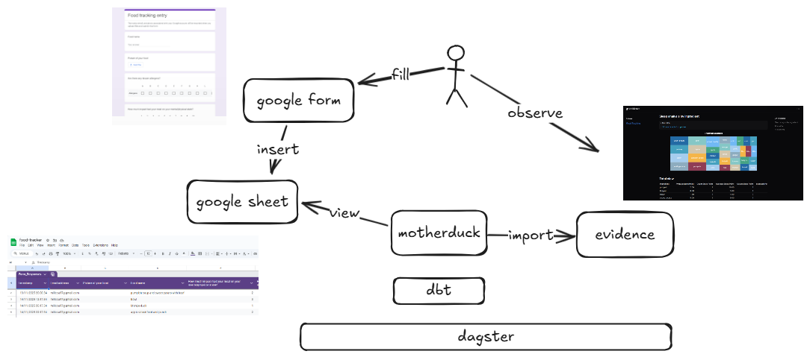

# food-tracking

Todo
- introduce dagster
- introduce dbt
- create separate dashbords for ingredients and allergens
- learn about github local ci/cd agent

Questions:
- How to refresh evidence from dagster when dbt model is ready? Currently it is doing data preparation and dashboard deployment with data from CI/CD pipeline

Rules I follow to fill the survey:
- Everything you eat goes into one row together
- One/two hours after the meal the self assesment should be added
- Dont eat other thing at least 3-4 hours after the meal
